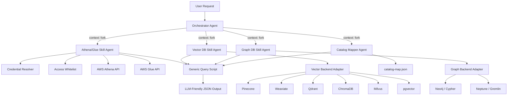

# Design Document: Data Analytics Skill Suite

## Overview

The Data Analytics Skill Suite is a Claude Code plugin that provides Data Scientists with a unified multi-agent system for querying, exploring, and correlating data across three paradigms: structured databases (AWS Athena/Glue), vector stores, and graph databases. The plugin follows the Claude Code plugin marketplace folder structure and uses SKILL.md-based skill definitions with `context: fork` for sub-agent isolation.

The architecture centers on an Orchestrator Agent that performs intent detection and delegates to specialized Skill Agents. Each skill encapsulates backend-specific logic behind a uniform tool interface. A cross-paradigm Catalog Mapper tracks lineage between data assets, and a Generic Query Script normalizes all outputs into a consistent LLM-friendly JSON format.

### Key Design Decisions

1. **Multi-backend adapter pattern**: Vector and Graph skills use a backend adapter interface so new backends can be added without modifying core skill logic.
2. **Context isolation via fork**: Each Skill Agent runs in a forked context to prevent cross-contamination of state between paradigms.
3. **Whitelist-first security**: The Athena skill denies all access unless explicitly whitelisted, following a deny-by-default posture.
4. **Persistent JSON catalog**: The Catalog Mapper uses a local JSON file for relationship storage, keeping the plugin self-contained without external database dependencies.
5. **Standardized output format**: All skills feed results through a common formatter to produce consistent LLM-friendly output.

## Architecture

### System Architecture Diagram



### Plugin Folder Structure

```
data-analytics-skill-suite/
├── .claude-plugin/
│   ├── plugin.json                    # Plugin manifest (name, description, version, author)
│   └── marketplace.json               # Marketplace metadata (owner, plugins list)
├── .mcp.json                          # MCP server configuration
├── settings.json                      # Default settings (sets orchestrator as default agent)
├── agents/
│   └── orchestrator.md                # Orchestrator agent definition (YAML frontmatter + markdown)
├── skills/
│   ├── athena-glue/
│   │   ├── SKILL.md                   # Athena/Glue skill (frontmatter: name, description, context: fork, allowed-tools)
│   │   ├── scripts/
│   │   │   ├── list_databases.py
│   │   │   ├── list_tables.py
│   │   │   ├── fetch_schema.py
│   │   │   ├── preview_data.py
│   │   │   └── execute_query.py
│   │   ├── references/
│   │   │   └── athena-best-practices.md
│   │   └── assets/
│   │       └── access-whitelist.json
│   ├── vector-db/
│   │   ├── SKILL.md                   # Vector DB skill (frontmatter: name, description, context: fork, allowed-tools)
│   │   ├── scripts/
│   │   │   ├── vector_search.py
│   │   │   ├── metadata_filter.py
│   │   │   ├── retrieve_by_id.py
│   │   │   └── list_collections.py
│   │   └── assets/
│   │       └── vector-config.json
│   ├── graph-db/
│   │   ├── SKILL.md                   # Graph DB skill (frontmatter: name, description, context: fork, allowed-tools)
│   │   ├── scripts/
│   │   │   ├── execute_cypher.py
│   │   │   ├── execute_gremlin.py
│   │   │   ├── list_schema.py
│   │   │   ├── get_properties.py
│   │   │   └── traverse_graph.py
│   │   └── assets/
│   │       └── graph-config.json
│   └── catalog-mapper/
│       ├── SKILL.md                   # Catalog Mapper skill (frontmatter: name, description, context: fork, allowed-tools)
│       ├── scripts/
│       │   ├── register_relationship.py
│       │   ├── query_relationships.py
│       │   ├── list_assets.py
│       │   └── generate_lineage.py
│       └── assets/
│           └── catalog-map.json
├── scripts/
│   └── format-query-output.py         # Generic Query Script
├── commands/                           # Slash command definitions (markdown files)
├── hooks/
│   └── hooks.json                     # Event handler definitions (PostToolUse, etc.)
├── SKILLS.md                           # Top-level documentation
└── README.md
```

**Plugin Settings (`settings.json`):**

Per the Claude Code plugin spec, `settings.json` can set a default agent that activates when the plugin is enabled:

```json
{
  "agent": "orchestrator"
}
```

This starts the `orchestrator` agent (from `agents/orchestrator.md`) as the main thread when the plugin is active, applying its system prompt and routing logic.


## Components and Interfaces

### 1. Plugin Manifest (`.claude-plugin/plugin.json`)

Per the Claude Code plugin specification, the manifest uses an `author` object (not a plain string) and may include optional fields like `homepage`, `repository`, `license`, and `keywords`.

```json
{
  "name": "data-analytics-skill-suite",
  "description": "Multi-agent skill suite for querying structured, vector, and graph databases",
  "version": "1.0.0",
  "author": {
    "name": "Data Analytics Team"
  },
  "keywords": ["data", "analytics", "athena", "vector", "graph", "catalog"],
  "license": "MIT"
}
```

### 1b. Marketplace Metadata (`.claude-plugin/marketplace.json`)

```json
{
  "name": "data-analytics-skill-suite",
  "owner": {
    "name": "Data Analytics Team"
  },
  "metadata": {
    "description": "Multi-agent skill suite for structured, vector, and graph database analytics",
    "version": "1.0.0"
  },
  "plugins": [
    {
      "name": "data-analytics-skill-suite",
      "source": "./",
      "description": "Multi-agent skill suite for querying structured, vector, and graph databases",
      "version": "1.0.0",
      "category": "data-science",
      "tags": ["athena", "glue", "vector-db", "graph-db", "data-catalog"]
    }
  ]
}
```

### 2. Orchestrator Agent

The Orchestrator Agent is defined in `agents/orchestrator.md` using the standard Claude Code subagent markdown format with YAML frontmatter.

**Agent Definition (`agents/orchestrator.md`):**
```markdown
---
name: orchestrator
description: Routes data analytics requests to the appropriate specialized skill agent based on detected intent. Handles multi-paradigm queries by sequential delegation.
---

You are the Data Analytics Orchestrator. Your role is to classify user intent and delegate to the correct specialized skill.

## Intent Classification Rules

- SQL, Athena, tables, schemas, databases, structured data → invoke `/data-analytics-skill-suite:athena-glue`
- Embeddings, vectors, similarity search, semantic search → invoke `/data-analytics-skill-suite:vector-db`
- Graphs, nodes, relationships, traversal, Cypher, Gremlin → invoke `/data-analytics-skill-suite:graph-db`
- Lineage, catalog, mapping, cross-paradigm relationships → invoke `/data-analytics-skill-suite:catalog-mapper`

## Multi-Paradigm Requests

When a request spans multiple paradigms, invoke each relevant skill sequentially and aggregate all responses into a unified reply.

## Ambiguous Requests

If you cannot confidently classify the intent, ask the user for clarification before delegating.
```

### 3. Athena/Glue Skill Agent

**SKILL.md Frontmatter (per Claude Code Agent Skills spec):**
```yaml
---
name: athena-glue
description: Query and explore AWS Athena datasets and Glue Data Catalog. Use when the user asks about SQL queries, table schemas, databases, structured data, or Athena.
context: fork
allowed-tools: Bash(python ${CLAUDE_SKILL_DIR}/scripts/*)
---
```

**SKILL.md Body (markdown instructions):**
```markdown
You are the Athena/Glue Data Catalog skill agent. You help users discover, explore, and query structured datasets.

## Available Tools

Run the following scripts to interact with AWS Athena and Glue:

- **List databases**: `python ${CLAUDE_SKILL_DIR}/scripts/list_databases.py`
- **List tables**: `python ${CLAUDE_SKILL_DIR}/scripts/list_tables.py <database>`
- **Fetch schema**: `python ${CLAUDE_SKILL_DIR}/scripts/fetch_schema.py <database> <table>`
- **Preview data**: `python ${CLAUDE_SKILL_DIR}/scripts/preview_data.py <database> <table> [max_rows]`
- **Execute query**: `python ${CLAUDE_SKILL_DIR}/scripts/execute_query.py "<sql>"`

## Security

All queries are validated against the access whitelist at `${CLAUDE_SKILL_DIR}/assets/access-whitelist.json`. Queries referencing unauthorized databases or tables will be rejected.

## Additional resources

- For whitelist configuration, see [assets/access-whitelist.json](assets/access-whitelist.json)
```

**Tool Signatures:**

```python
def list_databases() -> ListDatabasesResult:
    """List all databases in the AWS Glue Data Catalog."""

def list_tables(database: str) -> ListTablesResult:
    """List all tables in a specified Glue Data Catalog database.
    
    Args:
        database: Name of the Glue database.
    """

def fetch_schema(database: str, table: str) -> FetchSchemaResult:
    """Fetch full schema of a table including column names, types, and partition keys.
    
    Args:
        database: Name of the Glue database.
        table: Name of the table.
    """

def preview_data(database: str, table: str, max_rows: int = 100) -> PreviewDataResult:
    """Preview raw data from a table with configurable row limit.
    
    Args:
        database: Name of the Glue database.
        table: Name of the table.
        max_rows: Maximum rows to return (default: 100).
    """

def execute_query(sql: str) -> ExecuteQueryResult:
    """Execute an arbitrary SQL query against AWS Athena.
    
    Args:
        sql: The SQL query string.
    Returns:
        Result set with data_scanned_bytes and execution_time_ms metadata.
    """
```

**Credential Resolver:**

The Credential Resolver attempts credential discovery in this priority order:
1. IAM instance role (EC2/ECS/Lambda metadata endpoint)
2. Environment variables (`AWS_ACCESS_KEY_ID`, `AWS_SECRET_ACCESS_KEY`, `AWS_SESSION_TOKEN`)
3. Shared credential file (`~/.aws/credentials`)
4. AWS config file (`~/.aws/config`)
5. Named profile (from `AWS_PROFILE` env var or config)

```python
class CredentialResolver:
    DISCOVERY_ORDER = [
        "iam_role",
        "environment_variables",
        "shared_credential_file",
        "aws_config_file",
        "named_profile",
    ]

    def resolve(self) -> AWSCredentials:
        """Attempt credential discovery in priority order.
        
        Returns:
            AWSCredentials on success.
        Raises:
            CredentialResolutionError with list of attempted methods on failure.
        """
```

**Access Whitelist Enforcement:**

```python
class AccessWhitelist:
    def __init__(self, config_path: str = "skills/athena-glue/assets/access-whitelist.json"):
        """Load and validate the whitelist config.
        
        Raises:
            WhitelistConfigError if file is missing or malformed.
        """

    def is_authorized(self, database: str, table: str | None = None) -> bool:
        """Check if a database/table is in the whitelist."""

    def validate_query(self, sql: str) -> WhitelistValidationResult:
        """Parse SQL to extract referenced tables and validate all against whitelist.
        
        Returns:
            WhitelistValidationResult with authorized flag and list of unauthorized resources.
        """
```

### 4. Vector DB Skill Agent

**SKILL.md Frontmatter (per Claude Code Agent Skills spec):**
```yaml
---
name: vector-db
description: Vector similarity search and metadata filtering across multiple backends (Pinecone, Weaviate, Qdrant, ChromaDB, Milvus, pgvector). Use when the user asks about embeddings, vectors, similarity search, or semantic retrieval.
context: fork
allowed-tools: Bash(python ${CLAUDE_SKILL_DIR}/scripts/*)
---
```

**SKILL.md Body (markdown instructions):**
```markdown
You are the Vector Database skill agent. You help users perform vector search, metadata filtering, and embedding-based retrieval.

## Available Tools

Run the following scripts to interact with vector stores:

- **Vector search**: `python ${CLAUDE_SKILL_DIR}/scripts/vector_search.py <collection> '<query_embedding_json>' [top_k]`
- **Metadata filter**: `python ${CLAUDE_SKILL_DIR}/scripts/metadata_filter.py <collection> '<filters_json>'`
- **Retrieve by ID**: `python ${CLAUDE_SKILL_DIR}/scripts/retrieve_by_id.py <collection> <vector_id>`
- **List collections**: `python ${CLAUDE_SKILL_DIR}/scripts/list_collections.py`

## Additional resources

- For backend configuration, see [assets/vector-config.json](assets/vector-config.json)
```

**Backend Adapter Interface:**

```python
from abc import ABC, abstractmethod

class VectorBackendAdapter(ABC):
    @abstractmethod
    def connect(self, config: dict) -> None:
        """Establish connection to the vector store."""

    @abstractmethod
    def search(self, query_embedding: list[float], top_k: int) -> list[VectorResult]:
        """Perform similarity search."""

    @abstractmethod
    def filter_by_metadata(self, filters: dict) -> list[VectorResult]:
        """Filter vectors by metadata key-value pairs."""

    @abstractmethod
    def get_by_id(self, vector_id: str) -> VectorResult | None:
        """Retrieve a vector by its ID."""

    @abstractmethod
    def list_collections(self) -> list[str]:
        """List available collections/indices."""
```

**Supported Backend Implementations:**
- `PineconeAdapter(VectorBackendAdapter)`
- `WeaviateAdapter(VectorBackendAdapter)`
- `QdrantAdapter(VectorBackendAdapter)`
- `ChromaDBAdapter(VectorBackendAdapter)`
- `MilvusAdapter(VectorBackendAdapter)`
- `PgvectorAdapter(VectorBackendAdapter)`

**Backend Factory:**

```python
SUPPORTED_BACKENDS = ["pinecone", "weaviate", "qdrant", "chromadb", "milvus", "pgvector"]

def create_adapter(backend_type: str, config: dict) -> VectorBackendAdapter:
    """Create the appropriate backend adapter.
    
    Raises:
        UnsupportedBackendError listing supported backends if type is unknown.
    """
```

**Tool Signatures:**

```python
def vector_search(query_embedding: list[float], top_k: int = 10) -> VectorSearchResult:
    """Perform vector similarity search.
    
    Args:
        query_embedding: The query vector.
        top_k: Number of nearest neighbors to return.
    """

def metadata_filter(filters: dict) -> VectorSearchResult:
    """Filter vectors by metadata key-value expressions.
    
    Args:
        filters: Dictionary of metadata key-value filter expressions.
    """

def retrieve_by_id(vector_id: str) -> VectorResult | None:
    """Retrieve a vector by its ID.
    
    Args:
        vector_id: The unique identifier of the vector.
    """

def list_collections() -> ListCollectionsResult:
    """List all available collections or indices in the connected vector store."""
```

### 5. Graph DB Skill Agent

**SKILL.md Frontmatter (per Claude Code Agent Skills spec):**
```yaml
---
name: graph-db
description: Graph traversal, relationship discovery, and pattern-matching queries for Neo4j (Cypher) and Neptune/JanusGraph (Gremlin). Use when the user asks about graphs, nodes, relationships, traversal, or pattern matching.
context: fork
allowed-tools: Bash(python ${CLAUDE_SKILL_DIR}/scripts/*)
---
```

**SKILL.md Body (markdown instructions):**
```markdown
You are the Graph Database skill agent. You help users traverse graphs, discover relationships, and execute pattern-matching queries.

## Available Tools

Run the following scripts to interact with graph databases:

- **Execute Cypher**: `python ${CLAUDE_SKILL_DIR}/scripts/execute_cypher.py "<cypher_query>"`
- **Execute Gremlin**: `python ${CLAUDE_SKILL_DIR}/scripts/execute_gremlin.py "<gremlin_query>"`
- **List schema**: `python ${CLAUDE_SKILL_DIR}/scripts/list_schema.py`
- **Get properties**: `python ${CLAUDE_SKILL_DIR}/scripts/get_properties.py <label_or_type>`
- **Traverse graph**: `python ${CLAUDE_SKILL_DIR}/scripts/traverse_graph.py <start_node_id> [depth]`

## Additional resources

- For backend configuration, see [assets/graph-config.json](assets/graph-config.json)
```

**Backend Adapter Interface:**

```python
from abc import ABC, abstractmethod

class GraphBackendAdapter(ABC):
    @abstractmethod
    def connect(self, config: dict) -> None:
        """Establish connection to the graph database."""

    @abstractmethod
    def execute_query(self, query: str) -> GraphQueryResult:
        """Execute a native query (Cypher or Gremlin)."""

    @abstractmethod
    def list_node_labels(self) -> list[str]:
        """List all node labels in the graph."""

    @abstractmethod
    def list_relationship_types(self) -> list[str]:
        """List all relationship types in the graph."""

    @abstractmethod
    def get_properties(self, label_or_type: str) -> SchemaProperties:
        """Get properties and schema for a node label or relationship type."""

    @abstractmethod
    def traverse(self, start_node_id: str, depth: int = 3) -> GraphTraversalResult:
        """Traverse the graph from a starting node to a configurable depth."""
```

**Supported Backend Implementations:**
- `Neo4jAdapter(GraphBackendAdapter)` — Cypher queries
- `NeptuneGremlinAdapter(GraphBackendAdapter)` — Gremlin queries for Neptune/JanusGraph

**Tool Signatures:**

```python
def execute_cypher(query: str) -> GraphQueryResult:
    """Execute a Cypher query against a Neo4j backend."""

def execute_gremlin(query: str) -> GraphQueryResult:
    """Execute a Gremlin query against a Neptune/JanusGraph backend."""

def list_schema() -> GraphSchemaResult:
    """List all node labels and relationship types."""

def get_properties(label_or_type: str) -> SchemaProperties:
    """Retrieve properties and schema of a node label or relationship type."""

def traverse_graph(start_node_id: str, depth: int = 3) -> GraphTraversalResult:
    """Traverse the graph from a starting node up to a configurable depth (default: 3)."""
```

### 6. Catalog Mapper Skill Agent

**SKILL.md Frontmatter (per Claude Code Agent Skills spec):**
```yaml
---
name: catalog-mapper
description: Cross-paradigm data lineage and relationship tracking between Athena tables, vector collections, and graph nodes. Use when the user asks about data lineage, catalog mapping, or cross-paradigm relationships.
context: fork
allowed-tools: Bash(python ${CLAUDE_SKILL_DIR}/scripts/*)
---
```

**SKILL.md Body (markdown instructions):**
```markdown
You are the Data Catalog Relationship Mapper. You help users analyze, record, and track relationships and lineage between structured data, vector indices, and graph nodes.

## Available Tools

Run the following scripts to manage the cross-paradigm catalog:

- **Register relationship**: `python ${CLAUDE_SKILL_DIR}/scripts/register_relationship.py <source_asset> <target_asset> <relationship_type> [description]`
- **Query relationships**: `python ${CLAUDE_SKILL_DIR}/scripts/query_relationships.py <asset_id>`
- **List assets**: `python ${CLAUDE_SKILL_DIR}/scripts/list_assets.py`
- **Generate lineage**: `python ${CLAUDE_SKILL_DIR}/scripts/generate_lineage.py <asset_id>`

## Asset URI Scheme

Assets use URI-style identifiers: `athena://database.table`, `vector://collection_name`, `graph://node_label`

## Additional resources

- For the current catalog state, see [assets/catalog-map.json](assets/catalog-map.json)
```

**Tool Signatures:**

```python
def register_relationship(
    source_asset: str,
    target_asset: str,
    relationship_type: str,
    description: str | None = None
) -> RegisterResult:
    """Register a cross-paradigm relationship between two data assets.
    
    Args:
        source_asset: Identifier of the source asset (e.g., "athena://db.table").
        target_asset: Identifier of the target asset (e.g., "vector://collection_name").
        relationship_type: Type of relationship (e.g., "derived_from", "feeds_into", "indexes").
        description: Optional human-readable description.
    """

def query_relationships(asset: str) -> QueryRelationshipsResult:
    """Query all registered relationships for a specified data asset."""

def list_assets() -> ListAssetsResult:
    """List all registered data assets with their paradigm type."""

def generate_lineage(asset: str) -> LineageReport:
    """Generate a lineage report showing upstream and downstream relationships."""
```

**Catalog Persistence:**

The Catalog Mapper reads/writes `skills/catalog-mapper/assets/catalog-map.json`. On startup:
- If the file is missing, create an empty catalog: `{"assets": [], "relationships": []}`.
- If the file is malformed (invalid JSON or missing required keys), return a descriptive error and refuse write operations.

### 7. Generic Query Script

Located at `scripts/format-query-output.py`. Accepts raw query results from any skill and transforms them into the LLM-Friendly Format.

```python
def format_query_output(
    source_type: str,
    result_set: dict,
    query_timestamp: str | None = None
) -> str:
    """Transform a raw result set into LLM-Friendly JSON format.
    
    Args:
        source_type: One of "athena", "vector", "graph", "catalog".
        result_set: The raw result dictionary from the skill.
        query_timestamp: ISO 8601 timestamp (auto-generated if not provided).
    
    Returns:
        JSON string in LLM-Friendly Format.
    
    Raises:
        FormatError if result_set cannot be parsed.
    """
```


## Data Models

### Plugin Manifest Schema

Per the Claude Code plugin specification, the manifest requires these fields:

```json
{
  "name": "string (required) — plugin identifier in kebab-case, used as skill namespace prefix",
  "description": "string (required) — shown in plugin manager when browsing/installing",
  "version": "string (required) — semver format for version tracking",
  "author": {
    "name": "string (required) — maintainer or team name",
    "email": "string (optional) — contact email"
  },
  "homepage": "string (optional) — documentation URL",
  "repository": "string (optional) — source code URL",
  "license": "string (optional) — SPDX license identifier",
  "keywords": ["string (optional) — tags for discovery and categorization"]
}
```

### Access Whitelist Schema (`access-whitelist.json`)

```json
{
  "version": "1.0",
  "allowed": [
    {
      "database": "string (required) — Glue database name",
      "tables": ["string — table names, or '*' for all tables in database"]
    }
  ]
}
```

Example:
```json
{
  "version": "1.0",
  "allowed": [
    { "database": "analytics_prod", "tables": ["events", "users", "sessions"] },
    { "database": "data_lake", "tables": ["*"] }
  ]
}
```

### Vector Config Schema (`vector-config.json`)

```json
{
  "backend": "string (required) — one of: pinecone, weaviate, qdrant, chromadb, milvus, pgvector",
  "connection": {
    "host": "string (optional) — host URL or endpoint",
    "port": "number (optional) — port number",
    "api_key": "string (optional) — API key for managed services",
    "environment": "string (optional) — cloud environment/region",
    "database": "string (optional) — database name for pgvector",
    "extra": "object (optional) — backend-specific additional config"
  }
}
```

### Graph Config Schema (`graph-config.json`)

```json
{
  "backend": "string (required) — one of: neo4j, neptune-gremlin",
  "connection": {
    "uri": "string (required) — connection URI (bolt:// for Neo4j, wss:// for Neptune)",
    "username": "string (optional) — authentication username",
    "password": "string (optional) — authentication password",
    "database": "string (optional) — database name (Neo4j)",
    "region": "string (optional) — AWS region (Neptune)",
    "iam_auth": "boolean (optional) — use IAM auth for Neptune"
  }
}
```

### Catalog Map Schema (`catalog-map.json`)

```json
{
  "assets": [
    {
      "id": "string (required) — unique asset identifier using URI scheme",
      "paradigm": "string (required) — one of: structured, vector, graph",
      "name": "string (required) — human-readable name",
      "resolved": "boolean (required) — whether the asset exists in a connected backend"
    }
  ],
  "relationships": [
    {
      "id": "string (required) — unique relationship identifier (UUID)",
      "source_asset": "string (required) — source asset ID",
      "target_asset": "string (required) — target asset ID",
      "relationship_type": "string (required) — e.g., derived_from, feeds_into, indexes",
      "description": "string (optional) — human-readable description",
      "created_at": "string (required) — ISO 8601 timestamp"
    }
  ]
}
```

### LLM-Friendly Output Format

```json
{
  "header": {
    "source_type": "string — one of: athena, vector, graph, catalog",
    "query_timestamp": "string — ISO 8601 timestamp",
    "result_count": "number — total number of result rows"
  },
  "schema": {
    "fields": [
      {
        "name": "string — field name",
        "type": "string — data type (string, number, boolean, array, object)"
      }
    ]
  },
  "data": [
    {
      "field_name": "value — key-value pairs per row"
    }
  ]
}
```

### Normalized Vector Result

```json
{
  "id": "string — vector ID",
  "score": "number — similarity score",
  "metadata": "object — key-value metadata pairs",
  "payload": "array[number] | null — optional vector payload"
}
```

### Normalized Graph Result

```json
{
  "nodes": [
    {
      "id": "string — node ID",
      "labels": ["string — node labels"],
      "properties": "object — key-value properties"
    }
  ],
  "relationships": [
    {
      "id": "string — relationship ID",
      "type": "string — relationship type",
      "source": "string — source node ID",
      "target": "string — target node ID",
      "properties": "object — key-value properties"
    }
  ]
}
```

### Credential Resolution Error

```json
{
  "error": "credential_resolution_failed",
  "message": "Failed to resolve AWS credentials",
  "attempted_methods": [
    { "method": "string — method name", "result": "string — failure reason" }
  ]
}
```

### Whitelist Validation Result

```json
{
  "authorized": "boolean",
  "unauthorized_resources": [
    {
      "database": "string",
      "table": "string | null"
    }
  ]
}
```


## Correctness Properties

*A property is a characteristic or behavior that should hold true across all valid executions of a system — essentially, a formal statement about what the system should do. Properties serve as the bridge between human-readable specifications and machine-verifiable correctness guarantees.*

### Property 1: Plugin manifest contains all required fields

*For any* valid plugin manifest object, it must contain non-empty `name`, `description`, `version`, and `author` (object with `name` string) fields, conforming to the Claude Code plugin manifest schema.

**Validates: Requirements 1.1**

### Property 2: Skill auto-discovery without manifest changes

*For any* directory added under `skills/` that contains a valid `SKILL.md` file, the plugin discovery mechanism should detect and register the skill without any modifications to `plugin.json`.

**Validates: Requirements 1.8**

### Property 3: Orchestrator routes to correct skill by intent

*For any* user request with a deterministic intent mapping (SQL/Athena → athena-glue, embedding/vector → vector-db, graph/traversal → graph-db, lineage/catalog → catalog-mapper), the orchestrator should delegate to the correct Skill Agent.

**Validates: Requirements 2.1**

### Property 4: Multi-paradigm delegation covers all relevant skills

*For any* user request that references N distinct data paradigms, the orchestrator should delegate to exactly N Skill Agents and aggregate all N responses into the unified reply.

**Validates: Requirements 2.2, 2.3**

### Property 5: Ambiguous intent triggers clarification

*For any* user request where intent classification confidence is below the routing threshold, the orchestrator should respond with a clarification prompt rather than delegating to a skill.

**Validates: Requirements 2.5**

### Property 6: Fetch schema returns complete column metadata

*For any* valid database/table pair, `fetch_schema` should return a result containing column names, data types, and partition keys for every column in the table.

**Validates: Requirements 3.3**

### Property 7: Preview data respects row limit

*For any* table and any `max_rows` parameter value, `preview_data` should return at most `max_rows` rows.

**Validates: Requirements 3.4**

### Property 8: Query execution metadata is always present

*For any* SQL query executed via `execute_query`, the result should include `data_scanned_bytes` (non-negative integer) and `execution_time_ms` (non-negative integer) metadata fields.

**Validates: Requirements 3.6**

### Property 9: Credential resolver follows priority order

*For any* environment where multiple credential sources are available, the Credential Resolver should return credentials from the highest-priority source according to the defined order: IAM role > environment variables > shared credential file > AWS config file > named profile.

**Validates: Requirements 3.7**

### Property 10: Credential resolution failure lists all attempted methods

*For any* environment where no valid credentials exist, the Credential Resolver error should contain an `attempted_methods` list with exactly 5 entries (one per discovery method), each with a method name and failure reason.

**Validates: Requirements 3.8**

### Property 11: Whitelist enforcement rejects unauthorized resources and identifies them

*For any* SQL query and any whitelist configuration, if the query references one or more databases or tables not present in the whitelist, the query should be rejected and the error should list all specific unauthorized resources.

**Validates: Requirements 3.9, 3.10**

### Property 12: Vector backend adapter factory creates valid adapters for all supported backends

*For any* backend name in the supported set {pinecone, weaviate, qdrant, chromadb, milvus, pgvector}, the adapter factory should return a valid `VectorBackendAdapter` instance.

**Validates: Requirements 4.1**

### Property 13: Vector search respects top-k limit

*For any* query embedding and top-k value, `vector_search` should return at most top-k results, each containing the required fields: id, score, and metadata.

**Validates: Requirements 4.2**

### Property 14: Metadata filter returns only matching vectors

*For any* set of metadata filter expressions, all returned vectors should have metadata values that satisfy every filter condition.

**Validates: Requirements 4.3**

### Property 15: Vector retrieve-by-ID round trip

*For any* vector stored in the vector store, retrieving it by its ID should return a result with the same ID and matching metadata.

**Validates: Requirements 4.4**

### Property 16: Vector result normalization includes all required fields

*For any* backend and any raw result from that backend, the normalized output should contain `id` (string), `score` (number), `metadata` (object), and optionally `payload` (array or null).

**Validates: Requirements 4.8**

### Property 17: Unsupported vector backend error lists all supported backends

*For any* string not in the supported backends set, the error response should contain the complete list of supported backends.

**Validates: Requirements 4.9**

### Property 18: Vector connection failure error identifies backend and reason

*For any* failed connection attempt to a vector store, the error should contain the backend name and a non-empty failure reason string.

**Validates: Requirements 4.6**

### Property 19: Graph backend adapter factory creates valid adapters for all supported backends

*For any* backend name in the supported set {neo4j, neptune-gremlin}, the adapter factory should return a valid `GraphBackendAdapter` instance.

**Validates: Requirements 5.1**

### Property 20: Graph traversal respects depth limit

*For any* start node and depth parameter, `traverse_graph` should return only nodes reachable within the specified depth, and no node in the result should be farther than `depth` hops from the start node.

**Validates: Requirements 5.6**

### Property 21: Graph result normalization includes all required fields

*For any* backend and any raw query result, the normalized output should contain `nodes` (each with id, labels, properties) and `relationships` (each with id, type, source, target, properties).

**Validates: Requirements 5.9**

### Property 22: Graph connection failure error identifies backend and reason

*For any* failed connection attempt to a graph database, the error should contain the backend name and a non-empty failure reason string.

**Validates: Requirements 5.7**

### Property 23: Catalog register/query round trip

*For any* valid source asset, target asset, and relationship type, registering a relationship and then querying relationships for the source asset should return a result set that includes the registered relationship.

**Validates: Requirements 6.2, 6.3**

### Property 24: Catalog list assets returns all registered assets with paradigm

*For any* catalog state with N registered assets, `list_assets` should return exactly N assets, each with a valid paradigm type (structured, vector, or graph).

**Validates: Requirements 6.4**

### Property 25: Catalog persistence round trip

*For any* sequence of catalog operations, the state persisted to `catalog-map.json` should, when loaded, produce an equivalent catalog state.

**Validates: Requirements 6.5**

### Property 26: Unresolved assets are flagged

*For any* registered asset whose identifier does not correspond to an existing resource in any connected backend, the asset's `resolved` field should be `false`.

**Validates: Requirements 6.6**

### Property 27: Lineage report includes all transitive relationships

*For any* asset with upstream and downstream relationships, `generate_lineage` should return a report containing all transitively connected assets in both directions.

**Validates: Requirements 6.7**

### Property 28: LLM-Friendly Format validation

*For any* valid result set from any source type (athena, vector, graph, catalog), the formatted output should be valid JSON containing: a `header` with `source_type`, `query_timestamp`, and `result_count`; a `schema` with `fields` array where each field has `name` and `type`; and a `data` array where each element is a key-value object.

**Validates: Requirements 7.2, 7.3, 7.4, 7.5**

### Property 29: Format output is valid JSON

*For any* input to the Generic Query Script that does not trigger a parse error, the output should be parseable as valid JSON (serialization round trip: `json.loads(format_query_output(...))` succeeds).

**Validates: Requirements 7.8**

### Property 30: Formatter accepts all four source types

*For any* source type in {athena, vector, graph, catalog} and a valid result set for that type, `format_query_output` should produce a successful result without errors.

**Validates: Requirements 7.1**


## Error Handling

### Credential Resolution Errors

| Scenario | Behavior |
|---|---|
| No credentials found across all methods | Return `CredentialResolutionError` with all 5 attempted methods and their failure reasons |
| Credentials found but expired | Return error with method name and "credentials expired" reason |
| Credentials found but insufficient permissions | Allow Athena/Glue to return the AWS permission error naturally |

### Access Whitelist Errors

| Scenario | Behavior |
|---|---|
| Whitelist file missing | Refuse all data access operations; return error: "Access whitelist not found at skills/athena-glue/assets/access-whitelist.json" |
| Whitelist file malformed (invalid JSON) | Refuse all data access operations; return error with JSON parse details |
| Whitelist file missing required keys | Refuse all data access operations; return error identifying missing keys |
| Query references unauthorized table | Reject query; return error listing each unauthorized `database.table` |
| Query references unauthorized database | Reject query; return error listing the unauthorized database |

### Vector DB Errors

| Scenario | Behavior |
|---|---|
| Unsupported backend type | Return error listing all 6 supported backends |
| Connection failure | Return error with backend name and connection failure reason (timeout, auth, network) |
| Config file missing or malformed | Return error identifying the config path and parse issue |
| Empty search results | Return valid result with empty results array (not an error) |

### Graph DB Errors

| Scenario | Behavior |
|---|---|
| Unsupported backend type | Return error listing supported backends (neo4j, neptune-gremlin) |
| Connection failure | Return error with backend name and failure reason |
| Invalid Cypher/Gremlin syntax | Pass through the backend's native syntax error with context |
| Config file missing or malformed | Return error identifying the config path and parse issue |

### Catalog Mapper Errors

| Scenario | Behavior |
|---|---|
| `catalog-map.json` missing | Auto-create empty catalog: `{"assets": [], "relationships": []}` |
| `catalog-map.json` malformed | Return descriptive error; refuse all write operations until repaired |
| Asset not found in any backend | Set `resolved: false` on the asset; do not error |
| Duplicate relationship registration | Allow (idempotent); do not create duplicate entries |

### Generic Query Script Errors

| Scenario | Behavior |
|---|---|
| Unparseable input result set | Return `FormatError` identifying the source type and parse failure details |
| Empty result set | Return valid output with header, schema, and empty `data: []` |
| Unknown source type | Return error listing valid source types |

### General Error Response Format

All errors across the suite follow a consistent structure:

```json
{
  "error": "string — error code in snake_case",
  "message": "string — human-readable description",
  "details": "object (optional) — additional context"
}
```

## Testing Strategy

### Dual Testing Approach

The suite uses both unit tests and property-based tests for comprehensive coverage:

- **Unit tests**: Verify specific examples, edge cases, integration points, and error conditions
- **Property-based tests**: Verify universal properties across randomly generated inputs

### Property-Based Testing Configuration

- **Library**: [Hypothesis](https://hypothesis.readthedocs.io/) (Python)
- **Minimum iterations**: 100 per property test
- **Tag format**: Each test is annotated with a comment referencing the design property:
  ```python
  # Feature: data-analytics-skill-suite, Property 11: Whitelist enforcement rejects unauthorized resources and identifies them
  ```

### Unit Test Scope

Unit tests focus on:
- Specific examples demonstrating correct tool behavior (e.g., listing databases returns known test databases)
- Edge cases: missing config files, malformed JSON, empty result sets, expired credentials
- Integration points: credential resolver method ordering, adapter factory instantiation
- Error conditions: unsupported backends, unauthorized access, connection failures

### Property Test Scope

Each correctness property from the design maps to a single property-based test:

| Property | Test Description |
|---|---|
| P1: Manifest fields | Generate random manifest objects; verify all required fields present |
| P2: Skill auto-discovery | Generate random skill directories with SKILL.md; verify discovery |
| P3: Intent routing | Generate requests with known intents; verify correct skill delegation |
| P4: Multi-paradigm delegation | Generate multi-paradigm requests; verify all skills invoked |
| P5: Ambiguous intent | Generate ambiguous requests; verify clarification response |
| P6: Schema completeness | Generate random table schemas; verify fetch_schema returns all columns |
| P7: Row limit | Generate random max_rows values; verify result count ≤ max_rows |
| P8: Query metadata | Generate random queries; verify metadata fields present |
| P9: Credential priority | Generate environments with multiple credential sources; verify priority |
| P10: Credential failure | Generate environments with no credentials; verify error completeness |
| P11: Whitelist enforcement | Generate queries and whitelists; verify rejection and error detail |
| P12: Vector adapter factory | Iterate supported backends; verify adapter creation |
| P13: Vector top-k | Generate embeddings and top-k values; verify result count ≤ top-k |
| P14: Metadata filter | Generate filters and datasets; verify all results match filters |
| P15: Vector ID round trip | Store vectors; retrieve by ID; verify match |
| P16: Vector normalization | Generate raw results per backend; verify normalized fields |
| P17: Unsupported vector backend | Generate invalid backend names; verify error lists all supported |
| P18: Vector connection error | Simulate failures; verify error contains backend and reason |
| P19: Graph adapter factory | Iterate supported backends; verify adapter creation |
| P20: Graph depth limit | Generate traversals with various depths; verify depth constraint |
| P21: Graph normalization | Generate raw results per backend; verify normalized fields |
| P22: Graph connection error | Simulate failures; verify error contains backend and reason |
| P23: Catalog round trip | Register random relationships; query; verify presence |
| P24: Catalog list assets | Register random assets; list; verify count and paradigm |
| P25: Catalog persistence | Perform operations; save; reload; verify equivalence |
| P26: Unresolved assets | Register assets with no backend match; verify resolved=false |
| P27: Lineage completeness | Build relationship graphs; generate lineage; verify transitivity |
| P28: LLM format validation | Generate result sets per source; format; verify schema compliance |
| P29: JSON validity | Format random inputs; verify json.loads succeeds |
| P30: Source type acceptance | Iterate all 4 source types with valid data; verify no errors |

### Test File Organization

```
tests/
├── unit/
│   ├── test_credential_resolver.py
│   ├── test_access_whitelist.py
│   ├── test_athena_tools.py
│   ├── test_vector_adapter.py
│   ├── test_graph_adapter.py
│   ├── test_catalog_mapper.py
│   └── test_format_query_output.py
├── property/
│   ├── test_prop_manifest.py
│   ├── test_prop_orchestrator.py
│   ├── test_prop_athena.py
│   ├── test_prop_vector.py
│   ├── test_prop_graph.py
│   ├── test_prop_catalog.py
│   └── test_prop_formatter.py
└── conftest.py
```
